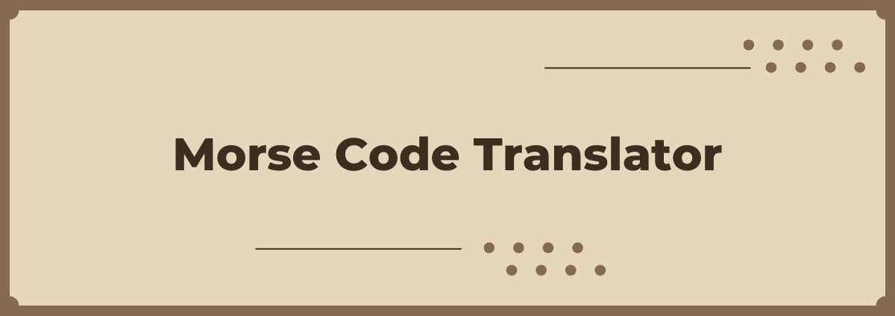
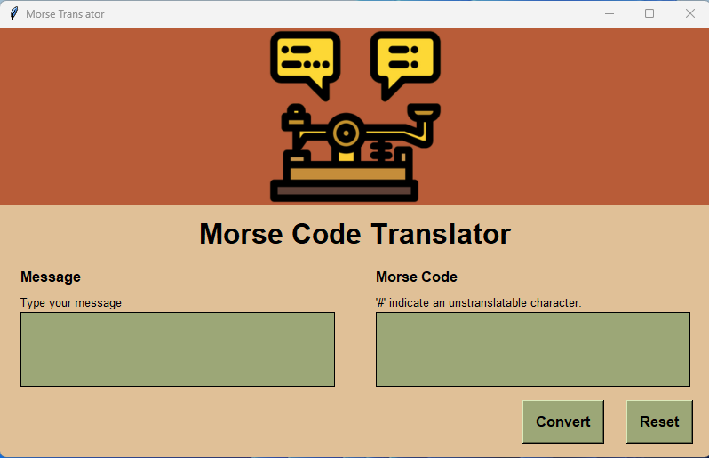

<h2 align='center'>Morse Code Translator</h2>

This project is a functional GUI built in Python and Tkinter. This application converts regular text into Morse code.



### Usage

1. After cloning this repository, run:

```sh
python main.py 
```

2. Enter the text you want to convert to Morse code when prompted and press the button "Convert".
3. The program will display the Morse code representation of your input.

### Tools


